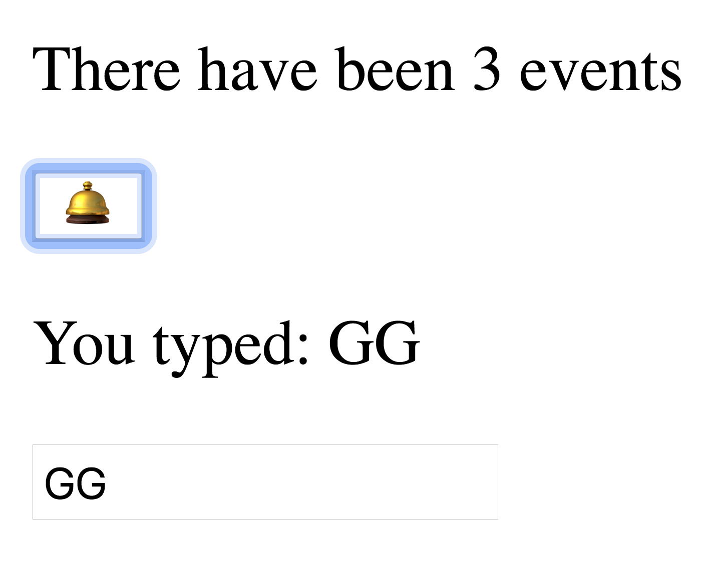
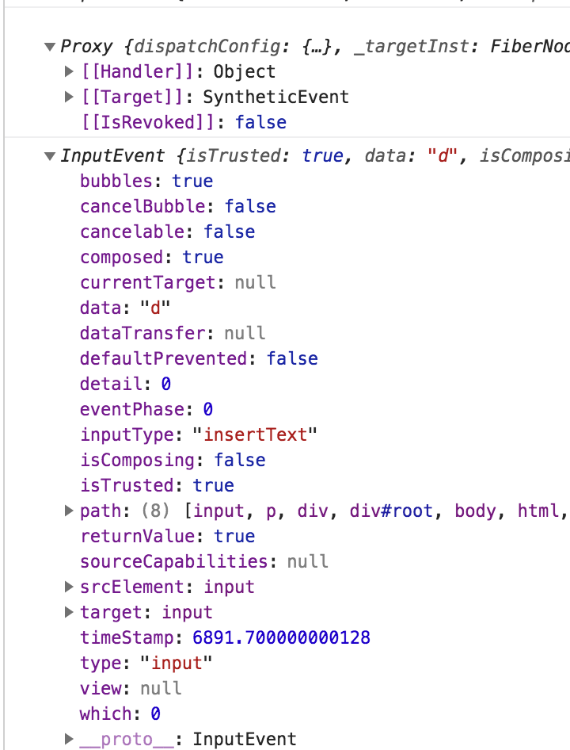
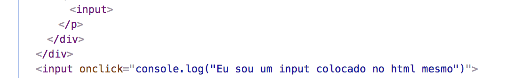

[link do curso](https://egghead.io/lessons/react-create-html-elements-with-react-s-createelement-api)

# EggHead the Begginer's Guide to React


# Aula 00: Introdução

  Estratégia do Curso: Começar com um html simples e ir divagarzin adicionando conceitos e coisas do React. Como o ```Reat.createElement``` funciona; como o JSX é só uma abstração em cima do React e como o babel funciona para fazer o JSX funcionar como se fosse parte do próprio JS.

  A ideia é mostrar que React é nada além de javascript, apenas objetos e funções. 

# Aula 01: Create HTML elements with React's createElement API

```html
  <div id="root"></div>
  <script type = "text/javascript">
    const rootElement = document.getElementById('root')
    const element = document.createElement('div')
    element.textContent = 'Hello World'
    element.className = 'container'
    rootElement.appendChild(element)
  </script>
```

com react é bem similar, vamos ter um createElement e vamos renderizar ele (não com o appendChild e sim com um método do react)

Primeiramente, precisamos colocar o react:

```html
<script crossorigin src="https://unpkg.com/react@16/umd/react.production.min.js"></script>
<script crossorigin src="https://unpkg.com/react-dom@16/umd/react-dom.production.min.js"></script>
```

O código acima em React seria dessa forma:

``` javascript
  const rootElement = document.getElementById('root')
  const element = React.createElement('div', {className: 'container'}, 'Hello World')
  ReactDOM.renbder(element, rootElement)
```

O ```createElement``` retora um objeto JS que tem alguns atributos. Um dos mais importantes é o __props__ que é um merge dos parâmetros que passamos no ```createElement``` (sem contar o primeiro, lógico). Podemos passar quantos parâmetros quisermos dentro do createElement que estarão dentro do ```children``` deste ```props``` como um array

``` javascript
  const element = React.createElement('div', {className: 'container'}, 'Hello World', 'how are you?')
```


outras forams de fazer a mesma coisa seria dentro do segundo parâmetro:


``` javascript
  const element = React.createElement('div', {className: 'container',
  children: ['Hello World', 'how are you?']})
```

No fim o ```React.createElement``` é simples: primeiro o elemento que quer criar, depois as propriedades que você quer que aquele objeto tenha e por fim filhos que aquele objeto deve ter.


# Aula 02: Replace React createElement Function Call with JSX


Criar toda nossa aplicação utilizando o ```React.createElement``` é possível, porém, não é muito ergonomico e de fácil entendimendo. Tendo isso em mente, o time do React criou o __JSX__ (javascript + XML). com o intuito de criar nossa UI de uma maneira que é um pouco mais familiar para nós.

Para o JSX funcionar precisamos transpilar nosso __JSX__ para o ```React.createElement```. Para isso vamos utilizar babel:

```html
  <script src="https://unpkg.com/babel-standalone@6.26.0/babel.js"></script>
  <!-- <script type = "text/javascript"> -->
  <script type = "text/babel">
```
> Lembre-se de mudar o o text/javascript para text/babel

Temos algumas diferenças. Em HTML usamos _class_ e no _JSX_ deve ser __className__.

```javascript
  //const element = React.createElement('div', {className: 'container'}, 'Hello World')
  const element = <div className = 'container'> Hello World </div>
```

Podemos também colocar variáveis, utilizando a interpolação (através de __\{\}__ podendo utilizar qualquer código javascript que quisermos desde que ele se resolva a uma expressão)

```javascript
  const content = 'Hello World'
  const element = <div className = 'container'> {content} </div>
```

Podemos até colocar funções se quisermos


```javascript
  const content = 'Hello World'
  const element = <div className = 'container'> {(() => content)} </div>
```
O mesmo vale para as propriedades


```javascript
  const content = 'Hello World'
  const myClassName = 'container'
  const element = <div className = {myClassName}> {content} </div>
```

Isso nos da poder e flexibilidade para fazer qualquer tipo de interpolação que quisermos, como por exemplo:

```javascript
  const content = 'Hello World'
  const myClassName = 'container'
  const element = <div className = {myClassName + '__hi-there'}> {content} </div>
```

> Isso ajuda bastante no BEM, porém, como o react tem o styled components ele supre a necessidade de fazer isso, já que o objetivo do BEM é isolar o escopo das coisas e o styled components já faz isso com os ids que ele cria

Outra coisa bem comum de fazer com _JSX_ é passar os props para o componente criado com _JSX_:


``` javascript 
  const props = {
    className: 'container',
    children: 'Hello World'
  }

  const element = <div {...props} />
```

Outra coisa legal é imaginar que este objeto com as propriedades está vindo para nós de algum outro lugar e queremos sobrescrevê-lo com algumas outras coisas (se não mandarem um className quero que tenha minha className por exemplo, ou mesmo que mandem quero que tenha uma minha)


``` javascript 
  const props = {
    className: 'container',
    children: 'Hello World'
  }

  const element = <div {...props} className = 'batata' children = 'Holla Mundo'/>
```

Desta forma estamos sobrescrevendo tudo que estiver no props (meio que o conceito de definir a variável duas vezes e ela ficar com o último valor). A propriedade __children__ também é alterada (podemos sobreescrever children ao fazer ```<div ...>{o_que_eu_quiser}<div/>``` também)

O jeito mais comum de trabalhar com JSX é este de colocar a tag HTML como se fosse o HTML mesmo, colocar as props com o _spread operator_ (```{...props}```) e sobrescrever qualquer coisa que queremos.

# Aula 03: Create a Simple Reusable React Component

Podemos utilizar a interpolação para não nos repetirmos

``` javascript
  const helloWorld = <div>Hello World</div>

  const element = (
    <div className="container">
      {helloWorld}
      {helloWorld}
    </div>
  )
```

Como é _javascript_ podemos utilizar uma função para o mesmo:

``` javascript
  const message = (props) => <div>{props.msg}</div>

  const element = (
    <div className="container">
      {message({msg: 'Hello World'})}
      {message({msg: 'Goodbye World'})}
    </div>
  )
```

Infelizmente, funções não "combinam" tão bem quanto o JSX então vamos tentar uma forma diferente. Podemos fazer com ``React.createElement``` e funcionará:

```javascript
  let message = (props) => <div>{props.msg}</div>
  let element = (
    <div className="container">
      {React.createElement(message, {msg: 'Hello World'})}
      {React.createElement(message, {msg: 'Goodbye World'})}
    </div>
  )
```

Porém, queremos agora utilizar como o _JSX_, geralmente criamos apenas uma tag com o que queremos: 

```javascript
  element = (
    <div className="container">
      <message />
      {React.createElement(message, {msg: 'Hello World'})}
      {React.createElement(message, {msg: 'Goodbye World'})}
    </div>
  )
```

Porém, ao fazer isso temos um problema. Como temos uma variável/função com o mesmo nome da tag que criamos o babel vai tentar compilar para um ```React.createElment``` e receberá as props como null e tentará criar um ```tag``` html ```"message"```. Para este caso em específico, isso é exatamente o que queremos, porém, em maioria dos casos podemos ter uma outra variável e acabar referenciando ela no momento da transpilação


Para evitar este tipo problema de referenciar alguma variável que já temos em algum lugar (sem intenção de referenciá-la) tem-se uma convenção de utilizar a primeira letra em maíusculo:


Agora temos um erro no console por não ter o _Message_:


Podemos então criar nosso componente:

```javascript

  const Message = (props) => <div>{props.msg}</div> // mesmma coisa do message anterior
  element = (
    <div className="container">
      <Message msg ='Hello World' />
      <Message msg ='Goodbye World' />
    </div>
  )

```

Agora podemos reutilizar o nosso componente em qualquer outro lugar e compor qualquer tipo de componente e tal.


É uma boa prática utilizar o children nestes casos onde queremos renderizar alguma coisa:

```javascript

  const Message = (props) => <div>{props.children}</div> // mesmma coisa do message anterior
  element = (
    <div className="container">
      <Message> 'Hello World' <Message/>
      <Message> 'Goodbye World' <Message/>
    </div>
  )

```


# Aula 04: Validate Custom React Component Props with PropTypes


As vezes vamos cometer erros ao passar propriedades para nossos componentes; principalmente qunado temos outras pessoas utilizando o nosso código. Supomos que temos o código a seguir: 

```javascript

  function SayHello(props) {
    return (
      <div>
        Hello {props.firstName} {props.lastName} !
      </div>
    )
  }
  const element = <SayHello firstName={true} />
  ReactDOM.render(element, rootElement)
```

Ele não está renderizando o que queremos (está renderizando apenas ```Hello !```)


Para avisar sobre esses erros podemos utilizar o PropTypes:

> É importante notar que o protoTypes só funciona na versão de development do react, fique atento ao src do react caso esteja usando o cdn para ser o de development

```javascript

    const PropTypes = {
    string(props, propName, componentName) {
      console.log('buahahahahah')
      if(typeof props[propName] !== 'string') {
        return new Error (`Hey, miguxo, você tem que passar uma string para ${propName} in ${componentName} mas você passou ${typeof props[propName]}`)
      }
    }
  } 

  SayHello.propTypes = {
    firstName: PropTypes.string,
    lastName: PropTypes.string
  }

  const element = <SayHello firstName={true} />
  ReactDOM.render(element, rootElement)

```

Dessa forma temos o erro impresso no log do sistema


Pelo fato desses erros serem comuns e esta tratativa padrão, o time do React criou o pacote ```PropTypes``` que implementa várias funções para nós! :D
Basta importar script e remover nossa implementação do PropTypes e pronto:

```html
<script src="https://unpkg.com/prop-types@15.6.2/prop-types.js"></script>
```

O único "problema" agora é que não temos mais o erro que acontecia no ```lastName```, isso acontece devido ao ```propTypes``` assumir que nem todas as propriedades são necessárias por padrão (o que é bom quando colocamos um valor padrão).
Para tornar elas necessárias basta:

```javascript
  SayHello.propTypes = {
    firstName: PropTypes.string.isRequired,
    lastName: PropTypes.string.isRequired
  }
```

Gerando os erros: 
```
Warning: Failed prop type: Invalid prop `firstName` of type `boolean` supplied to `SayHello`, expected `string`.
```
```
Warning: Failed prop type: The prop `lastName` is marked as required in `SayHello`, but its value is `undefined`.
```

Para ```Statefull Components``` (componentes que retornam ) podemos fazer da mesma maneira como acima (```NomeDoComponent.propTypes = {...}```) mas o mias comum é criar o __propTypes__ como atributo estático:

```javascript
  class SayHello extends React.Component {
    static propTypes = { 
      firstName: PropTypes.string,
      lastName: PropTypes.string
    }

    render () {
      console.log(this)
      console.log(PropTypes)
      const {firstName, lastName} = this.props
      return (
        <div>
          Hello {firstName} {lastName} !
        </div>
      )
    }
  }
```

> Ao mudar para a versão de produção ele não funciona pq ele deixa as coisas mais "lentas" devido às verificações e etc.
> Isso é bom mas se você ainda quiser melhorar ainda mais as cosias você pode usar um plugin do babel para remover os prop-types do seu código ao compilar para produção o


# Aula 05: Conditionally Render A React Component
 

``` javascript
  function Message({message}) {return <div>{message}</div>}
  const element = <Message message="Hello world" />
  ReactDOM.render(element, rootElement)
```

Caso tenhamos o código acima e, por algum motivo, quermeos que a mensagem seja nula ele simplesmente vai mostrar nada na tela (vai apenas criar a div). Se quisermos mostrar uma mensagem: ```Você não possui nenhuma mensagem``` podemos adicionar um condicional:

``` javascript
function Message({message}) {
    if(!message) {
      return <div>Ninguém te ama cara, você não tem mensagens</div>
    }
    return <div>{message}</div>
  }
  const element = <Message />
  //const element = <Message message={null}/>

  /*
    Ou então para ficar mais lindão
  */

  function Message({message}) {
    return  message 
      ? (<div>{message}</div>)
      : (<div>Ninguém te ama cara, você não tem mensagens</div>)
  }
```

# Aula 06: Rerender a React Application

Nesta aula ele cria um appzinho com um relógio em React de uma forma que vemos como funciona a atualização do React DOM e o quanto ele é eficiente com a utilização do virtual DOM.

```
<script type = "text/babel">
  const rootElement = document.getElementById('root')

  const time = new Date().toLocaleString()
  const element = <div> it is {time}</div>
  ReactDOM.render(element, rootElement)

</script>
```

Com o código acima mostramos o hotário atual, porém, só funciona quando atualizamos a página (tem que ficar atualizando para ver ele mudar). Para fazer ele atualizar de segundo em segundo podemos englobar esso código em uma função e fazer chamar de segundo a segundo com um ```setInterval```

```javascript
  function tick() {
    const time = new Date().toLocaleString()
    const element = <div> It is <input value = {time}></input></div>
    ReactDOM.render(element, rootElement)
  }
  tick()
  setInterval(tick, 1000)
```

Agora ele funciona bunitin, rodando de segundo em segundo.
O browser irá destacar de roxo o que está atualizando, "piscando" o horário conforme é atualizado segundo a segundo.


Se mudarmos a o time para um input e clicarmos nele pegamos o foco do input. O foco continua mesmo com o valor dele (o ```{time}``` e o foco (contorno azul do input) continua nele)

Vamos agora mudar o uso do React para o uso do JS normal

``` javascript
  function tick() {
    const time = new Date().toLocaleString()
    const element = `<div> It is  <input value = ${time}></input></div>`
    rootElement.innerHTML = element
  }
```

Dessa forma, podemos observar que o que está atualizando é o ```root``` inteiro.


Podemos ver o quanto que o React é eficiente com a sua renderização através do _Virtual DOM_ pois ele só atualiza o que realmente mudou, em contrapartida ao elemento inteiro.

# Aula 07: Style React Components with className and In Line Styles

O jeito como colocamos estilos nos componentes é uma das poucas diferenças que temos ao utilizar JSX e HTML. Ao invés de uma string o JSX recebe um objeto com as chaves das propriedades em ```camel case``` ao invés da separação por ífen e o valor da propriedade são strings:

```javascript
  const element = (
    <div>
      <div style={{paddingLeft: '20px'}}> box </div>
    </div>
  )
```

Caso o valor seja um número JSX considera que está em pixel, podendo trocar para:


```javascript
  const element = (
    <div>
      <div style={{paddingLeft: 20}}> box </div>
    </div>
  )
```


Outra diferença é a que já vimos com a ```className``` :

```javascript
  const props = {
    className: 'box box--small',
    style: {paddingLeft: 20}
  }
  const element = (
    <div>
      <div {...props}> box </div>
    </div>
  )
```

Uma cilada que podemos cair sem querer é fazer uma estilização default dentro do próprio componente e logo após adicionar outra estilização; como o style é uma propriedade ele será sobrescrito caso façamos da seguinte maneira (perdendo o paddingLeft):

```javascript
  function Box(props) {
    return (
      <div
        className = "box box--small"
        style = {{paddingLeft: 20}}
        {...props}
      >
      </div>
    )
  }
  const element = (
    <div>
      <Box  style = {backgroundColor: 'lightblue'}> box </Box>
    </div>
  )
```

Podemos fazer uma gambis para arrumar:


```javascript

  function Box({style, className = '', ...rest}) {
    return (
      <div
        className = {`box ${className.trim()}`}
        style = {{paddingLeft: 20, ...style}}
        {...rest}
      >
      </div>
    )
  }
  const element = (
    <div>
      <Box  style = {{backgroundColor: 'lightblue'}} className = 'box--small'> box </Box>
      <Box  style = {{backgroundColor: 'pink'}} className = 'box--medium'> box </Box>
      <Box  style = {{backgroundColor: 'orange'}} className = 'box--large'> box </Box>
    </div>
  )

```


Assim temos a flexibilidade para criar as caixinhas e colocar tudo do tamanho que queremos. 
Porém, segundo o fessô, temos que tirar essa responsabilidade do componente pai e deixar que o filho se reponsabilize por colocar/ajustar o tamanho das caixinhas:


```javascript

  function Box({style, size, className = '', ...rest}) {
    const sizeClassName = size ? `box--${size}` : ''
    return (
      <div
        className = {`box ${sizeClassName}`}
        style = {{paddingLeft: 20, ...style}}
        {...rest}
      >
      </div>
    )
  }
  const element = (
    <div>
      <Box  style = {{backgroundColor: 'lightblue'}} size = 'small'> box </Box>
      <Box  style = {{backgroundColor: 'pink'}} size = 'medium'> box </Box>
      <Box  style = {{backgroundColor: 'orange'}} size = 'large'> box </Box>
    </div>
  )

```


Assim fica muito mais simples para o componente pai ter o controle de como as coisas devem ser sem saber a implementação das mesmas. 


Existem alguns problmeas em usar in ```line style``` e existem algumas bibliotecas que nos ajudam com esses problemas além de outros:
  - <a href="https://www.styled-components.com/docs/basics" target="_blank">Styled Components</a>
  - <a href="https://emotion.sh/" target="_blank">Emotion</a>
  - <a href="https://glamorous.rocks/" target="_blank">Glamorous</a>

> Aqui na Evnts usamos o Styled Components (por questão de adesão da comunidade). Acredito que independente de qual desses você utilizar irá resolver grande parte dos problemas que o BEM (block-element-modifier) preza resolver, com encapsulamento de contexto e estados. Além disso, o Styled Components também oferece funcionalidades como temas e outras coisas.


# Aula08: Use Event Handlers with React

```javascript
  const state = {eventCount: 0, username: ''}

  function increment() {
    setState({
      eventCount: state.eventCount + 1
    })
  }

  function updateUserName(event) {
    console.log(event)
    console.log(event.native)
    setState({
      username: event.target.value
    })
  }

  function App() {
    return (
      <div>
        <p>There have been {state.eventCount} events</p>
        <p>
          <button onClick = {increment}
          >🛎</button></p>
        <p>You typed: {state.username}</p>
        <p><input onChange={updateUserName} /></p>
      </div>
    )
  }

  function setState(newState) {
    Object.assign(state, newState)
    renderApp()
  }

  function renderApp() {
    ReactDOM.render(
      <App />,
      document.getElementById('root')
    )
  }
  renderApp()
```

Com o app acima podemos clicar na campainha e incrementar o número de eventos e, ao digitar no input atualizar o texto logo após o ```You typed```. Ficou assim:




Se fizermos um ```console.log``` do evento que recebemos vemos que o React tem um Proxy dele que cuida de todos os eventos. Se quisermos acessar o evento nativo basta chamar ```event.nativeEvent```

```javascript
  console.log(event)
  console.log(event.nativeEvent)
```


Com este proxy o React otimiza algumas coisas para nós ao trabalhar com a delegação de eventos (existindo apenas um ```event handler``` para cada tipo dentro de todo o documento). 


Se inspecionarmos o elemento vemos que ele não tem o método onClick quando comparado com outro que foi criado estáticamente:




# AULA 09: Use Component State with React

Fala sobre a estratégia de criar o app como deveria ficar e depois migrar para os componentes com estado. Dessa forma fica muito mais fácil de entender o que deve ser propriedade, o que deve ficar no estado e etc.
Para isso:
  1. Começamos com um componente ```Stateless``` com as informações estáticas;

  ```javascript
    function StopWatch() {
      return (
        <div style = {{textAlign: 'center'}}>
            <label style = {{fontSize: '5em', display: 'block'}}>0ms</label>
            <button style = {buttonStyles}>Start</button>
            <button style = {buttonStyles}>Clear</button>
        </div>
      )
    }

    const element = <StopWatch/>

  ```

  2. Logo em seguida, retiramos as peças que precisam do estado em forma de propriedades mesmo (apenas para ver se está tudo renderizando corretamente e entender melhor o que deverá ficar no estado);


  ```javascript
    function StopWatch({lapse, running}) {
      return (
        <div style = {{textAlign: 'center'}}>
            <label style = {{fontSize: '5em', display: 'block'}}>{lapse}ms</label>
            <button style = {buttonStyles}>{running ? 'Stop' : 'Start'}</button>
            <button style = {buttonStyles}>Clear</button>
        </div>
      )
    }

    const element = <StopWatch lapse={10} running = {false}/>

  ```

  3. Movemos as variáveis que estão nos ```props``` para o estado;
  4. Adicionamos as iterações (```onClick```) e as lógicas para atualizar o estado e etc;

```javascript

  class StopWatch extends React.Component {
    state = {running: false, lapse: 0}
    handleRunClick = () =>  {
      this.setState( state => {
        if(state.running) {
          clearInterval(this.timer)
        } else {
          const startTime = Date.now() - this.state.lapse
          this.timer = setInterval( () => { this.setState({lapse: Date.now() - startTime})})
        }
        return {running: !state.running}
      })
    }

    handleClearClick = () =>  {
      clearInterval(this.timer)
      this.setState({lapse: 0, running: false})
    }

    render() {
      // const {lapse, running} = this.props
      const {lapse, running} = this.state
      return (
        <div style = {{textAlign: 'center'}}>
            <label style = {{fontSize: '5em', display: 'block'}}>{lapse}ms</label>
            <button onClick = {this.handleRunClick} style = {buttonStyles}>{this.state.running ? 'Stop' : 'Start'}</button>
            <button onClick = {this.handleClearClick} style = {buttonStyles}>Clear</button>
        </div>
      )
    }
  }
  const element = <StopWatch/>

```

> A função ```setState``` geralmente é utilizada passando o novo estado / o que queremos mudar. Ela também pode ser utilizada recebendo uma função onde seu primeiro parâmetro é o estado atual e esta função deve retornar o objeto que será o novo estado / o que queremos atualizar nele

> Outra coisa massa que ele faz é a criação de um "atributo" do componente _on the fly_: ```this.timer```


# BONUS: Coisas interessantes que o Wesley ensinou

O método ```render``` não pode alterar o estado, apenas renderizar o componente mesmo.

Ao fazer um app React e colocar uma função dentro de um ```onClick```, ou qualquer outra função que altera o estado de um componente, temos que vincular o contexto (```this```). 

Podemos fazer o estado (variável _running_ dentro dele) mudar da seguinte maneira:


``` javascript
    // "Método" dentro do componente
    changeButton ()  {this.setState({running: !this.state.running}, () => {console.log(this.state)})}
```
``` jsx
    <button onClick = {this.changeButton.bind(this)} style = {buttonStyles}>{running ? 'Stop' : 'Start'}</button>
```

Dessa forma temos que fazer o bind do contexto (```this```), porém, podemos utilizar uma _Arrow Function_ na declaração do "método" do componente, assim como as _Arrow functions_ capturam o valor de this do contexto vinculado não precisamos utilizar o ```bind```:

``` javascript
    // "Método" dentro do componente
    changeButton = () =>  this.setState({running: !this.state.running}, () => {console.log(this.state)})
```
``` jsx
    <button onClick = {this.changeButton} style = {buttonStyles}>{this.state.running ? 'Stop' : 'Start'}</button>
```

> Para mais informações sobre _Arrow Functions_ dê uma olhadinha no <a href="https://developer.mozilla.org/pt-BR/docs/Web/JavaScript/Reference/Functions/Arrow_functions" target="_blank"> MDN </a>, povo é foda e tem exemplos ótimos para mostrar a diferença ❤️


# Aula 10: Stop Memory Leaks with componentWillUnmount Lifecycle Method in React

